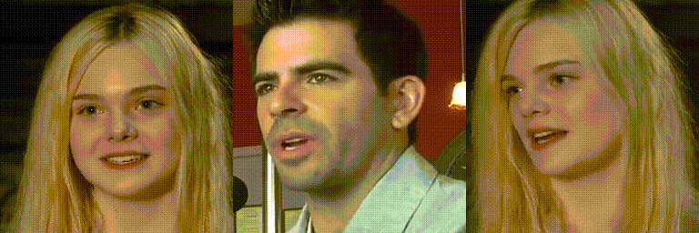
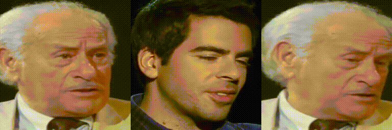

<div align="center">

# Synergizing Motion and Appearance: Multi-Scale Compensatory Codebooks for Talking Head Video Generation

### CVPR 2025

Shuling Zhao<sup>1</sup> &emsp; [Fa-Ting Hong](https://harlanhong.github.io/)<sup>1</sup> &emsp; [Xiaoshui Huang](https://xiaoshuihuang.github.io/)<sup>2</sup> &emsp; [Dan Xu](https://www.danxurgb.net/)<sup>1</sup>

<sup>1</sup>The Hong Kong University of Science and Technology <br>
<sup>2</sup>Shanghai Jiao Tong University

<a href='https://shaelynz.github.io/synergize-motion-appearance/'></a> 
<a href='https://arxiv.org/abs/2412.00719'></a>


<!---->


### Cross-identity Reenactment Results
 
 

### Method


</div>


## Updates
- **`2025/06/03`**: We released the training and inference code. Feel free to try it out!
- **`2024/11/29`**: We released this repo.

## Installation
### Clone the project
```
git clone https://github.com/ShaelynZ/synergize-motion-appearance.git
cd synergize-motion-appearance
```
### Build environment and install dependent packages
```
conda create -n appmotioncomp python=3.8 -y
conda activate appmotioncomp 
pip3 install -r requirements.txt -f https://download.pytorch.org/whl/torch_stable.html
```

## Quick Inference
### Download pretrained models
Download the pretrained models from [Onedrive](https://hkustconnect-my.sharepoint.com/:f:/g/personal/szhaoax_connect_ust_hk/Euur-8TShbNJr_i4yTMjtNUBFxm1OLaF2ndt2IymB6pC0w?e=cmZHYA) to the `pretrained_models` folder.

### Animation demo
```
CUDA_VISIBLE_DEVICES=0 python basicsr/demo.py --config options/test.yml  --source_image path/to/source --driving_video path/to/driving --result_video result.mp4 --find_best_frame --relative --adapt_scale
```
The result will be stored in ```result.mp4```.

The driving videos and source images should be cropped before it can be used in our method. To obtain some semi-automatic crop suggestions you can use `python crop-video.py --inp some_youtube_video.mp4`. It will generate commands for crops using ffmpeg.

## Training
### Prepare dataset
**VoxCeleb**: Please follow the instructions from [video-preprocessing](https://github.com/AliaksandrSiarohin/video-preprocessing).

### Train on VoxCeleb
Update the dataset path at `root_dir` in `options/train.yml`. 
```
CUDA_VISIBLE_DEVICES=0,1,2,3 python -m torch.distributed.launch --nproc_per_node=4 --master_port=4321 basicsr/train.py -opt options/train.yml --launcher pytorch
```
### Train on your own dataset
1. Resize all the videos to the same size e.g. 256x256, the videos should be in folders with images. Each video makes a separate folder with all the frames in '.png' format. This format is loss-less, and it has better i/o performance.
2. Create a folder `/path-to-data/[dataset_name]` with 2 subfolders `train` and `test`, put training videos in the `train` and testing in the `test`.
3. Create `options/train_[dataset_name].yml` similar to `options/train.yml`, in `datasets` specify the dataset name `name: [dataset_name]`, root dir  `root_dir: /path-to-data/[dataset_name]`. Also adjust the training iterations `total_iter` in `train`.

## Acknowledgement
Our implementation is based on [FOMM](https://github.com/AliaksandrSiarohin/first-order-model), [MCNet](https://github.com/harlanhong/ICCV2023-MCNET), [MRFA](https://github.com/JialeTao/MRFA) and [CodeFormer](https://github.com/sczhou/CodeFormer). We appreciate their great works.

## Citation
```
@InProceedings{Zhao_2025_CVPR,
    author    = {Zhao, Shuling and Hong, Fa-Ting and Huang, Xiaoshui and Xu, Dan},
    title     = {Synergizing Motion and Appearance: Multi-Scale Compensatory Codebooks for Talking Head Video Generation},
    booktitle = {Proceedings of the Computer Vision and Pattern Recognition Conference (CVPR)},
    month     = {June},
    year      = {2025},
    pages     = {26232-26241}
}
```

## Contact
If you have any question or collaboration needs, please email `szhaoax@connect.ust.hk`.

